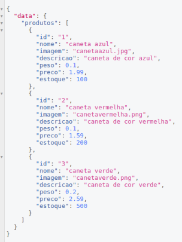
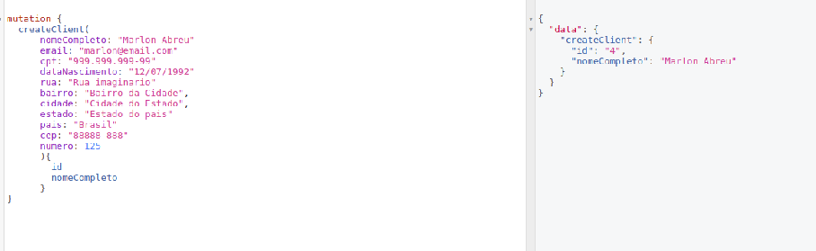
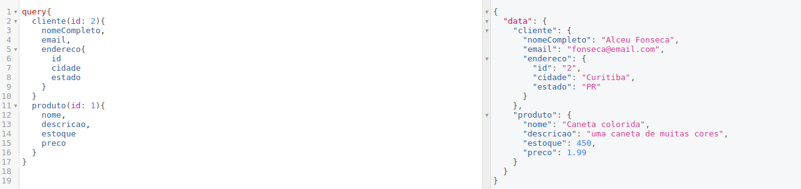

### teste-tecnico-bagy
Teste técnico realizado no processo seletivo da bagy

# Boas vindas ao repositório do teste técnico da Bagy!

## Iniciando o projeto

Para clonar esse repositório para o seu computador utilizando a chave SSH, abra o terminal e execute o seguinte comando: 

```sh
git clone git@github.com:guilhermehjunior/teste-tecnico-bagy.git
```
Ao abrir a pasta do projeto é necessário instalar as dependências, execute no terminal o comando:

```sh
npm install
```

## Desenvolvimento

Para o desenvolvimento dessa API foram utilizadas as stacks `node.js`, `graphql` eo banco de dados `SQLite`.

As seguintes bibliotecas foram utilizadas:

  -express(`node.js`)

  -express-graphql(ligação entre `node.js` e `graphql`)

  -graphql(`graphql`)

  -sqlite3(`SQLite`)

## Base de Dados

Como já mencionado anteriormente, a base de dados utilizada foi a `SQLite`;

E ao utilizar a biblioteca `sqlite3`, ela cria um arquivo com a base de dados no seu projeto, no caso desse, ela fica na raiz do projeto com o nome `teste-bagy.db`;

Na raiz do projeto existe o arquivo `dataBase.js` com todas as queries para criação do banco de dados.

Ela já vem pronta para utilização, mas caso ocorra algum problema ou só se deseje reiniciá-la, basta deletar o arquivo `teste-bagy.db` e executar o seguinte comando em seu terminal:

```sh
node dataBase.js
```

## Utilizando a API

Para iniciar a API e utilizá-la basta executar o comando: 
```sh
npm start
```

Após isso acesse em seu navegador o endpoint `http://localhost:3000/graphql`, nele você vai encontrar uma interface(`GraphiQL`) para realizar as requisições desejadas.

Nesse API de GraphQL é possível fazer 2 tipos de requisições, as `query` e as `mutation`.

`query` são requisições que buscam informação no banco de dado e `mutation` são requisições que alteram o banco de dados.

As `query` disponíveis nesse projeto são:

  -clientes

  -cliente

  -produtos

  -produto

  -pedidos

  -pedido

As `mutation` disponíveis são: 

  -createClient

  -updateClient

  -deleteClient

  -createProduct

  -updateProduct

  -deleteProduct

  -createOrder

  -updateOrder

  -deleteOrder

A GraphQL faz com que as requisições sejam feitas de modo 'gráfico', a pessoa escreve a query ou mutation que deseja e os campos que deseja receber.

Como exemplo, a `query` produtos funciona da seguinte forma(obs: a vírgula é opcional):

```
{
  produtos{
    id,
    nome,
    imagem,
    descricao,
    peso
    preco
    estoque
  }
}
```

Nesse caso estamos solicitando com a `query produtos` que ela retorne todos os produtos no nosso banco de dados e mostre os campos `id`, `nome`, `imagem`, `descrição`, `peso`, `preço` e `estoque`.
 Lembrando que não é necessário requisitar o retorno de todos os dados, só aqueles desejados.

O resultado da query é o seguinte:



### Query

#### Clientes

A `query` clientes tem a seguinte estrutura e os possíveis dados disponíveis:

```
{
  clientes{
    id,
    nomeCompleto
    email
    cpf
    dataNascimento
    enderecoId
    endereco{
      id
      rua
      bairro
      cidade
      estado
      pais
      cep
      numero
    }
  }
}
```

#### Cliente

A `query` cliente tem a seguinte estrutura e os possíveis dados disponíveis, nela é obrigatório passar o `id` do produto desejado:

```
{
  cliente(id: idDoClient){
    id,
    nomeCompleto
    email
    cpf
    dataNascimento
    enderecoId
    endereco{
      id
      rua
      bairro
      cidade
      estado
      pais
      cep
      numero
    }
  }
}
```

#### Produtos

A `query` produtos tem a seguinte estrutura e os possíveis dados disponíveis:

```
{
  produtos{
    id,
    nome,
    imagem,
    descricao,
    peso
    preco
    estoque
  }
}
```

#### Produto

A `query` produto tem a seguinte estrutura e os possíveis dados disponíveis, nela é obrigatório passar o `id` do produto desejado:


```
{
  produto(id: idDoProduto){
    id,
    nome,
    imagem,
    descricao,
    peso
    preco
    estoque
  }
}
```

#### Pedidos

A `query` pedidos tem a seguinte estrutura e os possíveis dados disponíveis:

```
{
  pedidos{
    id
    produtos{
      produtoId
      produto{
        ...produtos(informações disponíveis na query produtos)
      }
      quantidade
      pedidoId
    }
    dataPedido
    parcelas
    compradorId
    comprador{
      ...clientes(informações disponíveis na query clientes)
    }
  }
}
```

#### Pedido

A `query` pedido tem a seguinte estrutura e os possíveis dados disponíveis, nela é obrigatório passar o `id` do produto desejado:

```
{
  pedido(id: idDoPedido){
    id
    produtos{
      produtoId
      produto{
        ...produtos(informações disponíveis na query produtos)
      }
      quantidade
      pedidoId
    }
    dataPedido
    parcelas
    compradorId
    comprador{
      ...clientes(informações disponíveis na query clientes)
    }
  }
}
```

### Mutations

Na hora de realizar mutations é necessário acrescentar o termo `mutation` antes de realizar a requisição, um exemplo a seguir da createClient:

```
mutation{
  createClient(nomeCompleto: string, email: string, cpf:string, dataNascimento:string, rua: string, bairro: string, cidade: string, estado: string, pais: string, cep: string, numero: int){
    id
    nomeCompleto
    endereco{
      id
      rua
    }
  }
}
```

Nela são obrigatório os seguintes dados: `nomeCompleto`, `email`, `cpf`, `dataNascimento`, `rua`, `bairro`, `cidade`, `estado`, `pais`, `cep` e `numero` e como retorno ele passa as informações desejadas iguais da `query`
[cliente](#cliente).



#### createClient

A `mutation` createClient tem a seguinte estrutura e nela é obrigatório passar os dados `nomeCompleto`, `email`, `cpf`, `dataNascimento`, `rua`, `bairro`, `cidade`, `estado`, `pais`, `cep`, e e como retorno ele passa as informações desejadas iguais da `query`[cliente](#cliente).

```
mutation{
  createClient(nomeCompleto: string, email: string, cpf:string, dataNascimento:string, rua: string, bairro: string, cidade: string, estado: string, pais: string, cep: string, numero: int){
    id
    nomeCompleto
    endereco{
      id
      rua
    }
  }
}
```

#### updateClient

A `mutation` updateClient tem a seguinte estrutura e nela é obrigatório passar os dados: `id`, `nomeCompleto`, `email`, `cpf`, `dataNascimento`, `rua`, `bairro`, `cidade`, `estado`, `pais`, `cep`, e `numero` e como retorno ele passa as informações desejadas iguais da `query`[cliente](#cliente).

```
mutation{
  updateClient(id: idDoCliente,nomeCompleto: string, email: string, cpf:string, dataNascimento:string, rua: string, bairro: string, cidade: string, estado: string, pais: string, cep: string, numero: int){
    id
    nomeCompleto
    endereco{
      id
      rua
    }
  }
}
```

#### deleteClient

A `mutation` deleteClient tem a seguinte estrutura e nela é obrigatório passar o dado: `id` e como retorno ele passa uma mensagem confirmando que o item foi deletado.

```
mutation{
  deleteClient(id: idDoCliente){
    message
  }
}
```

#### createProduct

A `mutation` createProduct tem a seguinte estrutura e nela é obrigatório passar os dados: `nome`, `imagem`, `descricao`, `peso`, `preco`, `estoque`,  e como retorno ele passa as informações desejadas iguais da `query`[produto](#produto).

```
mutation{
  createProduct(nome:string, imagem:string, descricao:string, peso: float, preco: float ,estoque: int){
    id,
    nome,
    estoque
  }
}
```

#### updateProduct

A `mutation` updateProduct tem a seguinte estrutura e nela é obrigatório passar os dados: `id`, `nome`, `imagem`, `descricao`, `peso`, `preco`, `estoque`,  e como retorno ele passa as informações desejadas iguais da `query`[produto](#produto).

```
mutation{
  updateProduct(id: idDoProduto, nome:string, imagem:string, descricao:string, peso: float, preco: float, estoque: int){
    id,
    nome,
    estoque
  }
}

```

#### deleteProduct

A `mutation` deleteProduct tem a seguinte estrutura e nela é obrigatório passar o dado: `id` e como retorno ele passa uma mensagem confirmando que o item foi deletado.

```
mutation{
  deleteProduct(id: idDoProduto){
    message
  }
}
```

#### createOrder

A `mutation` createOrder tem a seguinte estrutura e nela é obrigatório passar os dados: `produtos`, `dataPedido`, `parcelas`, `compradorId`, `status`, `quantidade`,  e como retorno ele passa as informações desejadas iguais da `query`[pedido](#pedido).

```
mutation{
  createOrder(produtos: array com Id dos produtos, dataPedido:string, parcelas: int, compradorId: idDoClient, status: string, quantidades:array com as quantidades dos produtos){
    id
    produtos{
      produto {
        id
        nome
      }
      quantidade
    }
    parcelas
  }
}
```

#### updateOrder

A `mutation` updateOrder tem a seguinte estrutura e nela é obrigatório passar os dados: `id`, `produtos`, `dataPedido`, `parcelas`, `compradorId`, `status`, `quantidade`,  e como retorno ele passa as informações desejadas iguais da `query`[pedido](#pedido).

```
mutation{
  createOrder(id: idDoPedido, produtos: array com Id dos produtos, dataPedido:string, parcelas: int, compradorId: idDoClient, status: string, quantidades:array com as quantidades dos produtos){
    id
    produtos{
      produto {
        id
        nome
      }
      quantidade
    }
    parcelas
  }
}
```

#### deleteOrder

A `mutation` deleteOrder tem a seguinte estrutura e nela é obrigatório passar o dado: `id` e como retorno ele passa uma mensagem confirmando que o item foi deletado.

```
mutation{
  deleteOrder(id: idDoPedido){
    message
  }
}
```

### Multi Query ou Mutation

Em uma única `query` ou `mutation` é possível realizar requisições diversas com outras `query` ou `mutation`.

Como exemplo abaixo, será feito uma requisição para receber um `cliente` e um `produto` onde são retornados apenas alguns campos.

```
query{
  cliente(id: 2){
    nomeCompleto,
    email,
    endereco{
      id
      cidade
      estado
    }
  }
  produto(id: 1){
    nome,
    descricao,
    estoque
    preco
  }
}
```

A imagem a seguir demonstra o retorno dessa query:

